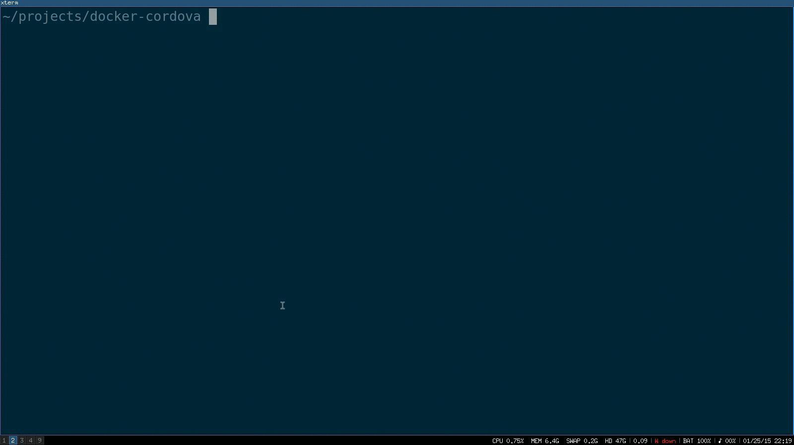

# Docker container for Cordova development

## Content

* [why](#why)
* [Setup](#setup)
* [New Project](#new-project)
* [Useful commands](#useful-commands)
* [References](#references)

## Why?

I don't want to install and configure Java, Android SDK, Ant, cordova etc.. life is too short.

## Setup

    git clone git@github.com:oren/docker-cordova.git
    cd docker-cordova
    docker build -t cordova .
    alias mine='sudo chown -R $USER'
    alias drun='docker run -it --rm'
    alias cordova='drun --privileged -v /dev/bus/usb:/dev/bus/usb -v $PWD:/src cordova cordova'

The alias command lets you use `cordova` for running any command inside the cordova container.

## New Project

    cordova create hello
    cd hello
    cordova platform add android
    cordova build

Connect your android device to your laptop with a usb

    cordova run android

That's it, your app should be on your phone!

## Useful commands

### List of attached devices

Make sure you see your phone in that list.

    docker run --rm -i -v $(pwd):/workspace -w /workspace \
        --privileged -v /dev/bus/usb:/dev/bus/usb cordova adb devices

### Run with different user

To ensure the container uses the same user id as the caller use the
-u option and provide a writeable HOME directory to that user (change the alias if necessary!)

    alias cordova='docker run --rm -i -u `id -u` -v $PWD:/src -e "HOME=/tmp" cordova cordova'

## References

The image is based on https://github.com/Kallikrein/dockerfiles/tree/master/android-cordova~/projects/myAPP
